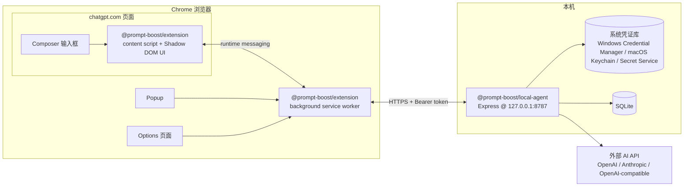
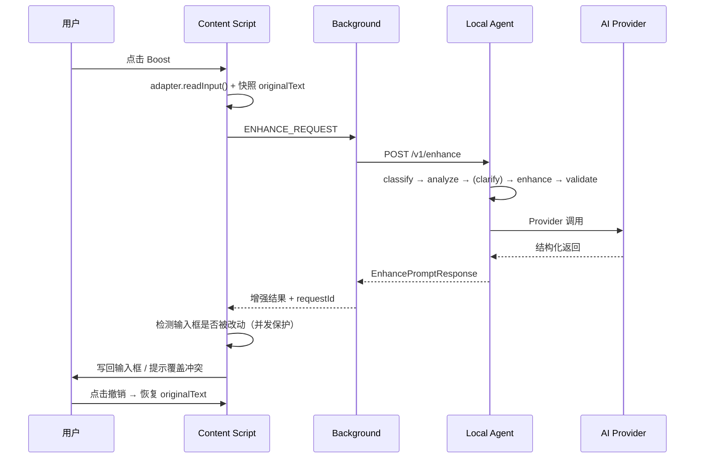

# Prompt Boost — Architecture

> Version 0.1.0 · MVP scope

## 1. 系统总览



## 2. 模块职责

| 模块 | 目录 | 职责 |
| --- | --- | --- |
| Extension · Content | `apps/extension/src/content` | 识别/读取/写回输入框；注入 Boost UI；监听 DOM；承载 `BoostController` 状态机；展示 loading / 追问 / 撤销。 |
| Extension · Background | `apps/extension/src/background` | 消息转发 content ↔ local-agent；扩展设置读取；本地服务健康检查；错误标准化。 |
| Extension · Popup | `apps/extension/src/popup` | 显示开关、服务连接状态、当前模型、打开设置、版本号。 |
| Extension · Options | `apps/extension/src/options` | Provider / 模型 / 默认模式 / 隐私说明 / 清除本地数据。 |
| Extension · Platform | `apps/extension/src/platform` | `PlatformAdapter` 接口 + `chatgpt` 适配器。DOM 查询只允许出现在这里。 |
| Local Agent | `apps/local-agent/src` | 本地 HTTPS 服务：认证、Provider 编排、Prompt Engine、安全存储、SQLite、校验。 |
| Shared | `packages/shared` | 类型、Zod schema、消息契约、常量。扩展与服务端共用。 |
| Prompt Core | `packages/prompt-core` | 纯逻辑：任务分类、评分计算、增强策略描述。 |

## 3. 分层原则

```
UI (content/popup/options)
   │  只经过消息契约
Background
   │  HTTPS + Bearer token
Local Agent (api/providers/prompt-engine/security)
   │  Provider adapter
External AI API
```

- Content Script **不保存 API Key、不直接调用模型、不执行增强算法**。
- Local Agent 是唯一接触 Provider 和凭证的进程。
- UI、平台适配、业务逻辑、Provider 相互分离，禁止跨层直调。

## 4. 数据流（一键增强）



## 5. 消息流（Extension 内部）

Content Script 通过 `chrome.runtime.sendMessage` 与 Background 通信，`background.ts` 中按消息类型路由。所有消息体使用 Shared 中的 Zod schema 校验。

## 6. Provider 架构（后续阶段）

```ts
interface ModelProvider {
  testConnection(): Promise<ConnectionTestResult>;
  enhancePrompt(req: EnhancePromptRequest): Promise<EnhancePromptResponse>;
  analyzePrompt(req: AnalyzePromptRequest): Promise<AnalyzePromptResponse>;
}
```

Provider 采用 strategy 模式注册，`createProvider(type, config)` 按 `ProviderType` 返回实现。切换 Provider 不修改业务代码。新增 Provider 只需增加一个 adapter 与配置项。

## 7. Prompt Engine 架构（后续阶段）

五层流水线：

```
Input Normalizer → Task Classifier → Prompt Analyzer → Clarification Planner → Prompt Enhancer → Output Validator
```

- 系统提示词按职责拆分（classifier / analyzer / clarifier / enhancer-{quick,deep,expert} / validator）。
- 每层输出经 Zod schema 校验；JSON 解析失败最多修复重试一次。
- 评分由 `prompt-core` 的程序计算：模型只返回维度判断，总分由权重加权得出。

## 8. 本地服务安全模型

- 只监听 `127.0.0.1:8787`（不监听 `0.0.0.0`）。
- 首次启动生成随机令牌写入 `data/.auth-token`（chmod 0600）；启动日志只显示脱敏形式（`pb_****xxxx`），完整令牌通过 `pnpm agent:token:show` 主动获取。
- 所有请求需 `Authorization: Bearer <token>`；错误返回统一脱敏格式。
- 请求体大小限制；调用超时；日志不记录 API Key，不记录 Prompt（默认）。
- 扩展 `host_permissions` 仅覆盖 `http://127.0.0.1:8787/*`，配合令牌双重防护。
- `/v1/analyze` 为 POST-only（请求体 `{ originalText, taskType, enhanceLevel, clarificationMode }`），Prompt 不出现在查询参数。

## 9. 状态机（Content BoostController）

```ts
type BoostState = "idle" | "reading" | "analyzing" | "clarifying" | "enhancing" | "writing" | "success" | "error";
```

- `reading` 快照原文 → `analyzing`（Local Agent）→ `clarifying`（追问浮层）→ `enhancing` → `writing`（写回）→ `success`。
- 并发保护：返回结果前重新读取输入框；用户已改动则弹出覆盖冲突选择。
- 每次请求带唯一 `requestId`；可取消上一次请求。

## 10. 技术选型

| 层 | 选型 |
| --- | --- |
| 包管理 | pnpm workspace |
| 语言 | TypeScript (strict) |
| 扩展构建 | Vite (多入口) + Manifest V3 |
| 扩展 UI | React 18 + Shadow DOM 注入 |
| 本地服务 | Express + Zod + better-sqlite3 |
| 安全存储 | 系统凭证库封装（Windows Credential Manager / macOS Keychain / Linux Secret Service），开发模式退化为加密文件存储并明确标注 |
| 测试 | Vitest（单测/集成），Playwright（E2E，后续阶段） |
| 代码质量 | ESLint 9 + Prettier |
